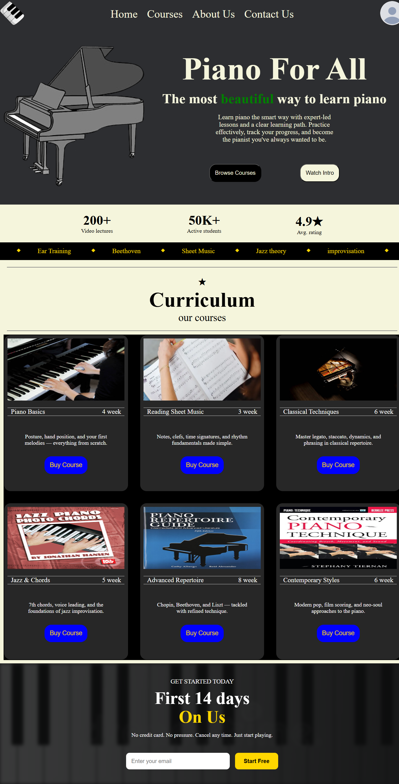
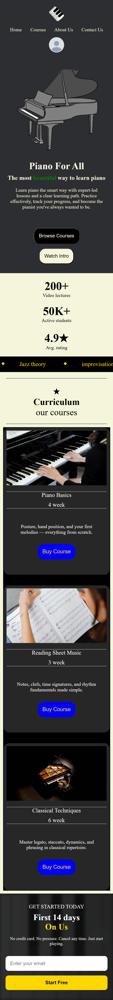

🎹 Piano For All

A modern and responsive piano learning website built using HTML and CSS.

Live Demo:
```
https://pianoforall3.netlify.app/
```

About The Project

Piano For All is a front-end web project designed to showcase an online piano learning platform. The website provides a clean and engaging user interface where visitors can explore piano courses, view learning statistics, and sign up for a free trial.

The goal of this project was to practice responsive web design, layout creation using Flexbox and CSS Grid, and building a visually appealing landing page without using any JavaScript frameworks.


Features

* Responsive design for desktop, tablet, and mobile devices
* Modern landing page layout
* Hero section with call-to-action buttons
* Course showcase section
* Animated scrolling feature banner
* Student achievement statistics
* Email signup section
* CSS Grid-based course cards
* Flexbox-based navigation and layouts
* Custom styling and media queries

Technologies Used

* HTML5
* CSS3
* Flexbox
* CSS Grid
* Media Queries
* Netlify (Deployment)


Screenshots

Homepage

<p align="center">
  
</p>

Mobile View

<p align="center">
  
</p>


Project Structure

```
PianoForAll/
│
├── index.html
├── style.css
│
├── static/
│   ├── piano-logo.webp
│   ├── piano-hero-background3.jpg
│   ├── contact-us-bg-img.webp
│   ├── course1.jpg
│   ├── course2.jpg
│   ├── course3.jpg
│   ├── course4.jpg
│   ├── course5.jpg
│   └── course6.jpg
│
└── README.md
```

Getting Started

Clone the repository:-
```
git clone https://github.com/yourusername/PianoForAll.git
```

Open the project
Simply open `index.html` in your browser.
No additional installation or dependencies are required.

Responsive Design

The website is optimized for:
* Desktop Screens
* Tablets
* Mobile Devices

Responsive layouts are implemented using CSS media queries.

Learning Outcomes
Through this project I practiced:

* Semantic HTML structure
* CSS Flexbox
* CSS Grid
* Responsive Web Design
* Media Queries
* Project Deployment using Netlify
* UI/UX design fundamentals

Future Improvements
* Add JavaScript functionality
* User authentication system
* Interactive piano keyboard
* Course purchase workflow
* Video lesson integration
* Dark/Light mode toggle
* Backend integration for email subscriptions

Author

Ved Teli

Full Stack Developer with interests in Web Development, AI, and Cybersecurity.

This project is licensed under the MIT License.
